<h1 align="center">
  Camping Família X
</h1>

  

  

  

  

  

<b>

  Link para acessar o projeto <a href="https://camping-familia-x.netlify.app" target="_blank">Camping Família X</a>

</b>
<h2 align="center">
  Imagens do projeto desktop
</h2>
  

  
  
  

  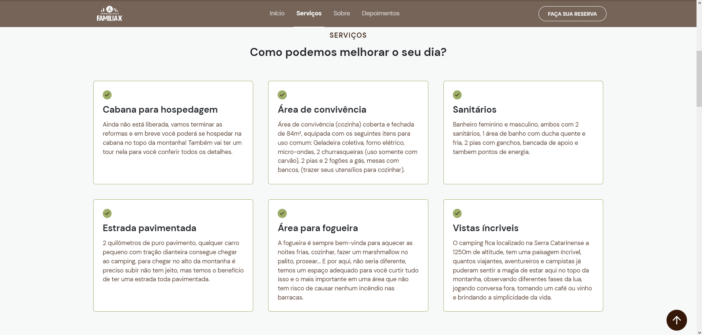
  

  

  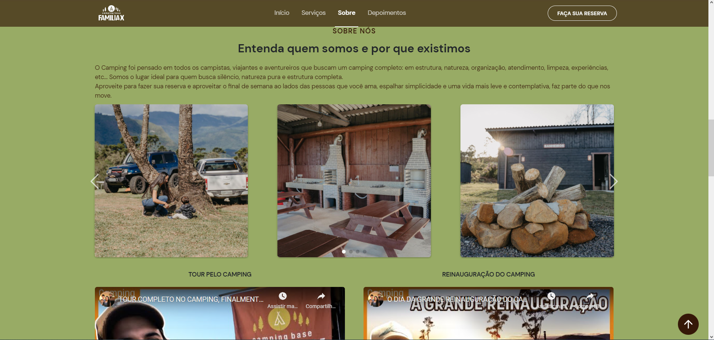
  

  

  
  

  

  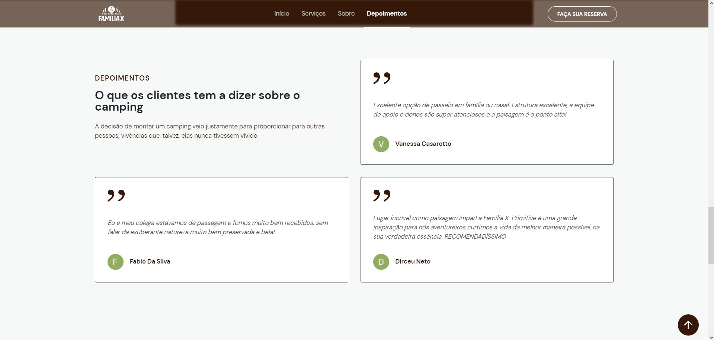
  

  

  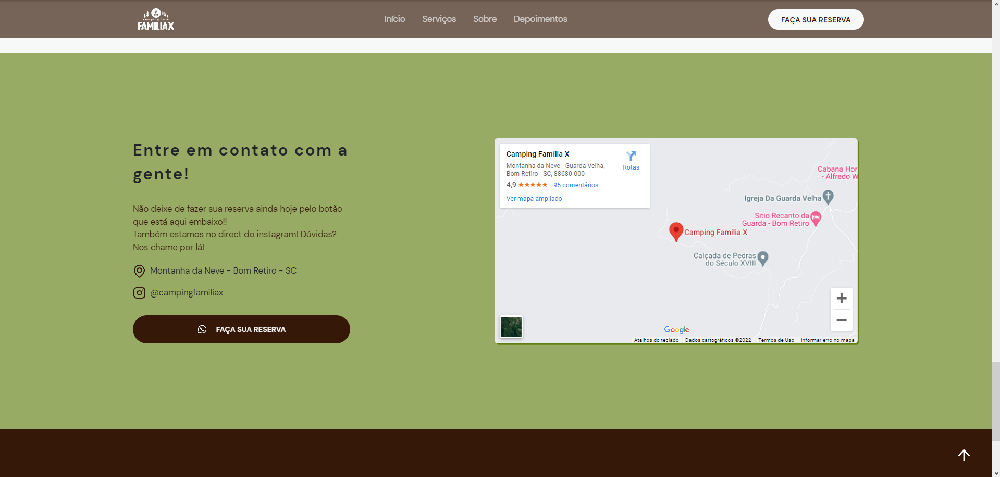
  

  

  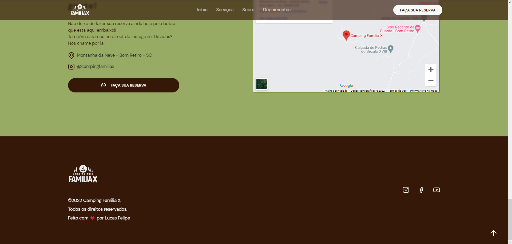
  

<h2 align="center">
  Imagens do projeto mobile
</h2>
  

  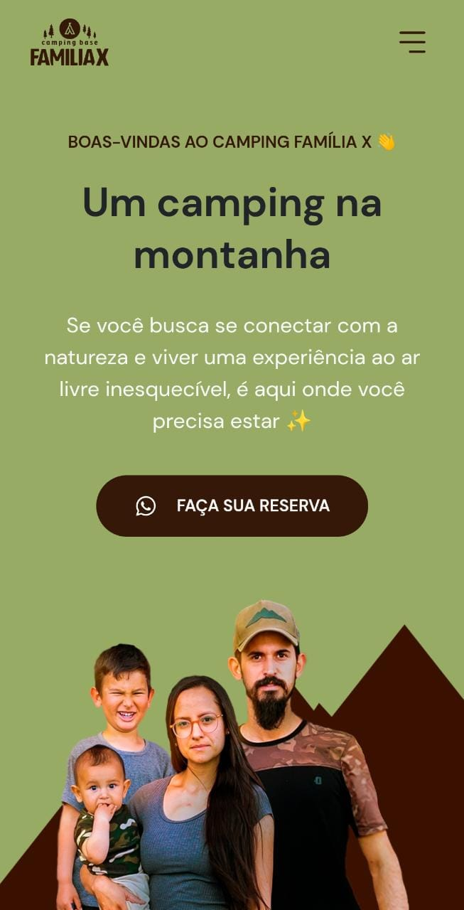
  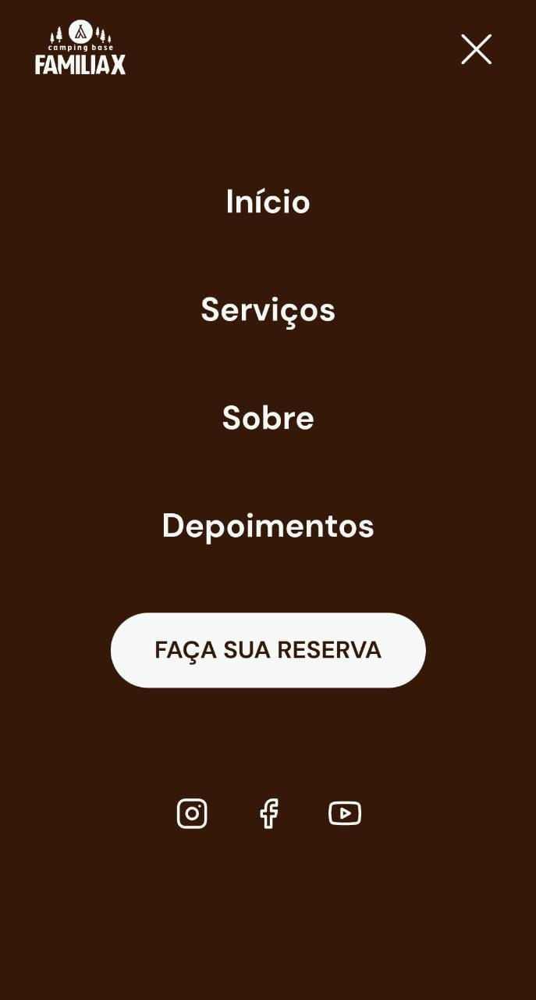
  
  

  

  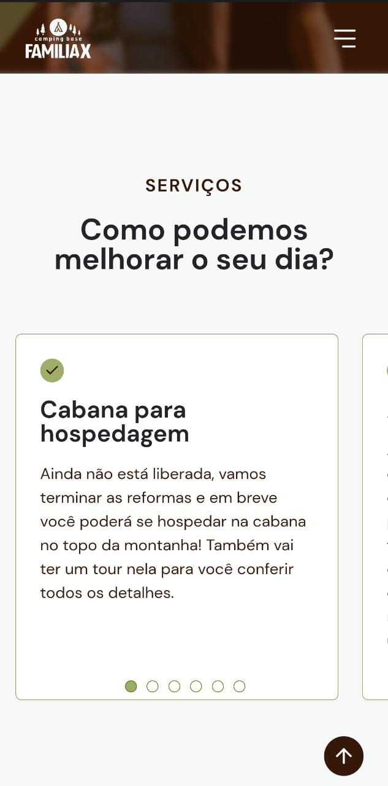
  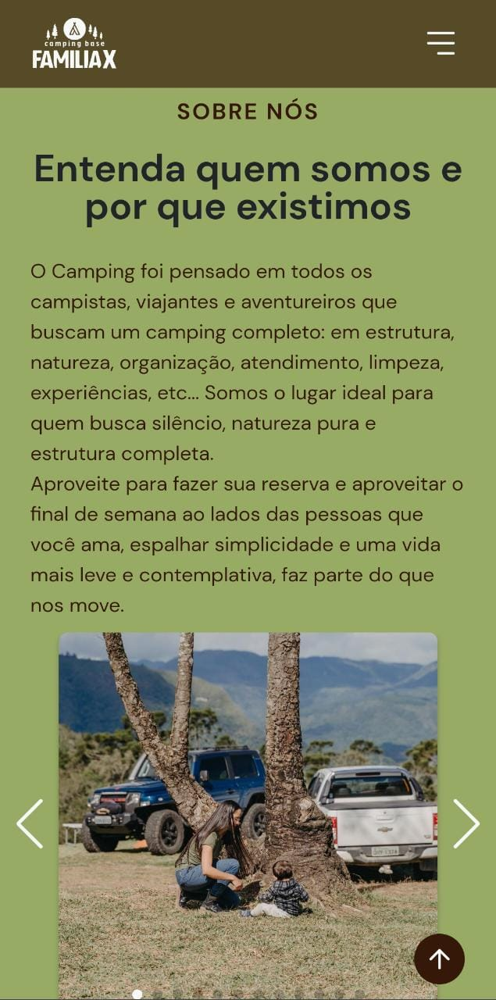
  

  
  

  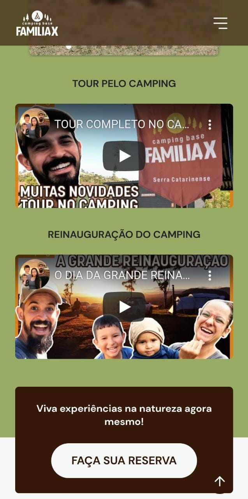
  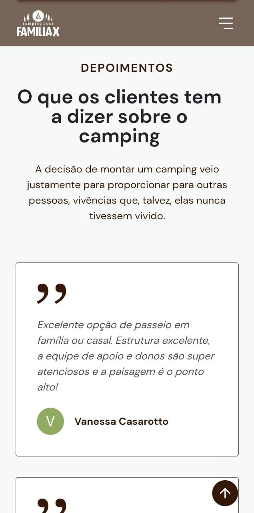
  

  
  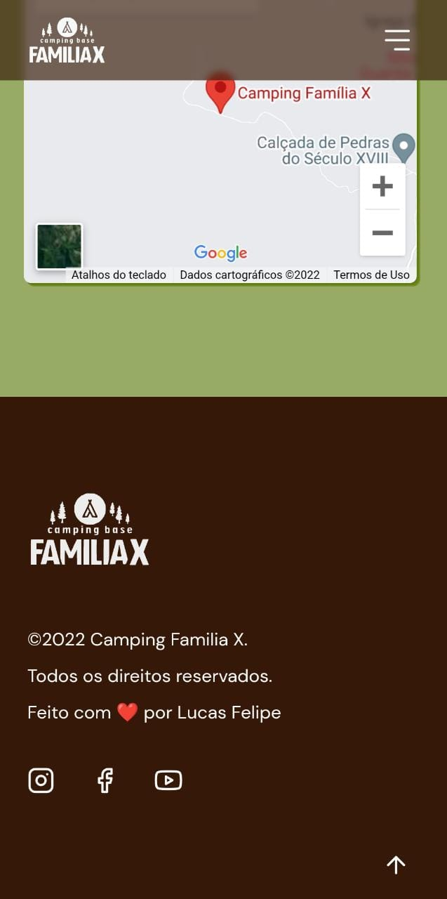
  

## 💻 Projeto

Antes era apenas um projeto para teste mas agora é um projeto voluntario realizado durante o **Evento NLW Return** para a família X. 
Foi uma semana de muito aprendizado e descoberta, o codigo pode ter ficado extenso e com alguns erros mas é comum para quem está em processo de aprendizagem, quando terminei o projeto não tinha nem 1 mês de programação (como relatado nas imagens de como estava minhas contribuições na data de publicação do projeto). 
O fato de ter diversas funcionalidades "inúteis" ou sem um "padrão", é justamente porque utilizei esse projeto para treinar e buscar antes de tudo evoluir minha lógica e capacidade de botar minhas ideias em prática. 
O protótipo desse website foi desenvolvido pelo [**Jonas Milan**](https://www.instagram.com/jonasmilancc/), [clique aqui](https://www.figma.com/community/file/1102912263666619803) para abrir o protótipo no figma.

Ferramentas usadas nesse projeto:
- VSCode
- Figma
- Photoshop
## 📥 Conhecimento adquirido:

Durante a criação desse projeto aprendi muitos macetes de HTML e CSS, também consegui aplicar lógica básica em alguns algoritmos no JavaScript e também ouvi dicas excelentes sobre Mobile First, trajetoria de um programador e desafios que vou encontrar seguindo nessa carreira.

## 📈 Desafios que tive:

Meu maior desafio durante a criação desse projeto foi conseguir desenvolver minhas ideias e colocar elas em pratica de uma forma organizada com o conhecimento que eu tinha. Entretanto, consegui adquirir muito conhecimento nesse processo para aplicações futuras.

## 👨‍💻 Informações pessoais
<h2 align="center">
  Contribuições no dia do projeto.
</h2>

  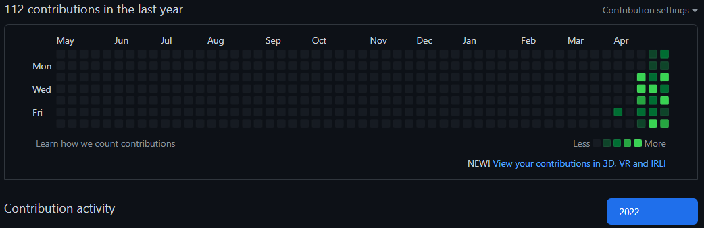

    
<small>Redes do criador</small>

    <section>
        
Linkedin: <a href="https://www.linkedin.com/in/lucas-felipe-39ab96236/" target="_blank" rel="noopener noreferrer">Lucas Felipe</a>

        
Github: <a href="https://github.com/lucasfelipe-s" target="_blank" rel="noopener noreferrer">Lucas Felipe</a>

        
Instagram: <a href="https://www.instagram.com/_lucasflp/" target="_blank" rel="noopener noreferrer">@_lucasflp</a>

    </section>

